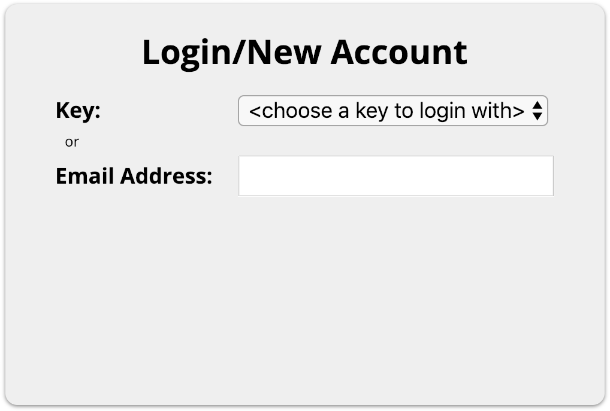

# Kagi

Email + Password authentication on websites needs to die. Security breaches have proven that we shouldn't trust 3rd parties with our passwords or email addresses. Authentication by asymmetric keypairs is safer, faster and in many ways less cumbersome. Kagi provides a native app to interact with existing ssh keys, front-end code for websites to interface with that app and backend code to produce cryptographic challenges and verify responses. 

This project is very early in development (still proof-of-concept really, but already deployed and working) and needs a lot of features/platform support written. Feel free to chip in ;)

## Keys vs Email + Password

In situations where your account is secured by **only** your public key:

**PROS**

* No memorization needed.
* No management needed (like password managers).
* Never expires/changes. 
* Safe to use the same key on multiple sites.
* No lengthy, manual and potentially spam filtered validation process.
* Requires no personally sensitive information (website can't sell or spam your email address).
* No risk to users in the event of a server compromise.
* Can completely validate at the network edge without the need to touch the origin server (like in a Cloudflare Worker).
* Faster.

**CONS**

* Some initial, technical setup.
* No account recovery possible (private key compromise/loss equates to account compromise/loss). 
* Some nominal storage requirements server-side (public keys can be a little long).
* Easy for bots to spam servers with signups (mitigateable).

## How It Works

First, you need to have at least one private RSA key in PEM format located it in your `~/.ssh/` directory. You might already have a few of these generated for any number of reasons. If you don't, you can generate a new one like this:

```
openssl genrsa -out ~/.ssh/<your new key name> 2048
```

Next, the `Kagi` executable needs to be running. You can build `Apps/macOS/Kagi.xcodeproj` and then launch it however you want (It will eventually be repackaged as an unprivileged launch agent). Once it's running, it looks at every file in `~/.ssh/` and loads any suitable keys it finds. It then opens port `18797` and blocks on connections. 

Then when you visit a website that has Kagi support, logic using `Frontend/kagi.js` will contact `Kagi` and ask it to `/list` all the public keys it has available for authentication. The website's logic then takes that list and builds out UI allowing the user to either select an available key or use a legacy authentication method. 

<div style='text-align: center; margin-top: 10px; margin-bottom: 10px;'></div>

After the user selects one of the available keys, the website's frontend logic takes the selected public key and passes it to a backend server. The server backend takes the user's public key and creates a cryptographic challenge using logic such as `Backend/php/kagi.php`.  The generated challenge contains a timestamp, some random data and a hash of those values plus the provided public key and a secret only known to the server. The server then passes this challenge back to the frontend code running in the client's web browser. 

Once the browser logic receives the challenge, it passes it to `Kagi` using the `/sign` endpoint. Inside `Kagi`, it generates a prefix of random data, combines that with the received challenge and signs the combined data with the corresponding private key (this prefix prevents external actors from being able to induce your private key to sign anything they throw at it). It then passes a payload back containing the `publickey`, `prefix`, `challenge` and `signature` to the frontend logic which then in turn passes it to the backend server logic as a login request (instead of a username/email/password). 

The backend logic then starts to examine that package of login request information. It first looks at the challenge and extracts the timestamp when it was created. If it is expired (longer than 30 seconds old or some other short timeframe) then it fails the request. This is to prevent replay attacks where malicious intermediaries (ad network/injected Javascript, rouge browser extensions) might be able to sniff and save legitimate login request payloads and then play them back later to acquire authentication tokens. Replay attacks are certainly possible within the 30 second window, but this can easily be mitigated by having server logic that only allows logins once every 30 seconds (another way might be to store the current successful login attempt number server-side and include it in the challenge hash as an additional server secret to be checked against). 

After verifying that the challenge has not expired, it reconstructs the challenge hash using the timestamp, the given random data, the given public key and a server held secret. If the reconstructed hash matches the one that was passed in, then the backend knows that this challenge was created by this server for this specific public key at the given time. This prevents malicious actors from replaying valid login requests for other keys or for the same key on a different server. If the hash checks out, then it combines the provided prefix data with the challenge data and verifies the combined result against the given signature. If the signature checks out, then we know that the holder of the corresponding private key did indeed sign the challenge data that our server generated within the required timeframe. 

At this point, the client has proven to the server that they hold the private key and should be given access to the account associated with the given public key. The backend server logic can then lookup the user by their public key and return authentication tokens just as if they had logged in with a password. If no user exists with that public key, then the server could at that point create a new user with nothing more than the public key. 

## Current Platform Support

Native Apps

* macOS

Frontend

* Javascript

Backend

* PHP

Don't see what you like? Help contribute!

## TODO

* Ask the user every time a signing request comes in for permission.
* Add support for password protected key files.
* Add support for keys residing in the Keychain on macOS.
* Record what resources have requested signing and prioritize that key the next time that source asks.
* Shouldn't allow key exposure if permissions are too permissive (just like ssh).
* Figure out a way to more gracefully prod to see if the port is open/responsive.
* Flesh out more platform support.

## Built With

* [GCDWebServer](https://github.com/swisspol/GCDWebServer) - macOS built-in web server
* [Sparkle](https://sparkle-project.org) - macOS self-updater

## License

This project is licensed under the [MIT License](LICENSE.md)
